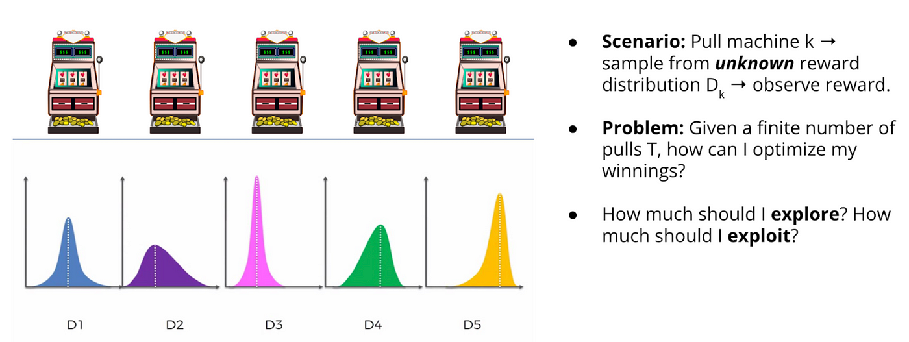

# Immediate RL & Bandits

In many scenarios, the action that we take don't show their effect immediately, but over time. Like when you lose in chess, which move caused you to lose might not be the last move you made. Or, when you fall of your bike, you don't know which action caused you to fall off.

But, In many cases, the **`action we take show their effect immediately`**.

!!! quote ""
    Like when you play a slot machine, you know exactly how much you won or lost. Each lever that you pull is an action, and the outcome is the reward that you get immediately. And, it doesn't effect later pulls.

Such problems are called **`Immediate RL`** or **`Multi-Armed Bandits`** problems.

---

## Exploration vs exploitation

- Exploration: Trying out new actions to find out which ones are good.
- Exploitation: Doing the action that gives the best reward.

!!! warning "Explore-Exploit dilemma"
    - Explore to find profitable actions.
    - Exploit to act according to the best observations already made.
    - Always exploit might not be optimal.
    - Always explore might not be optimal either.
    - Hence, there is an **`Explore-Exploit`** dilemma.

## Bandits

A **`Bandit`** is a problem where the action we take show their effect immediately.
