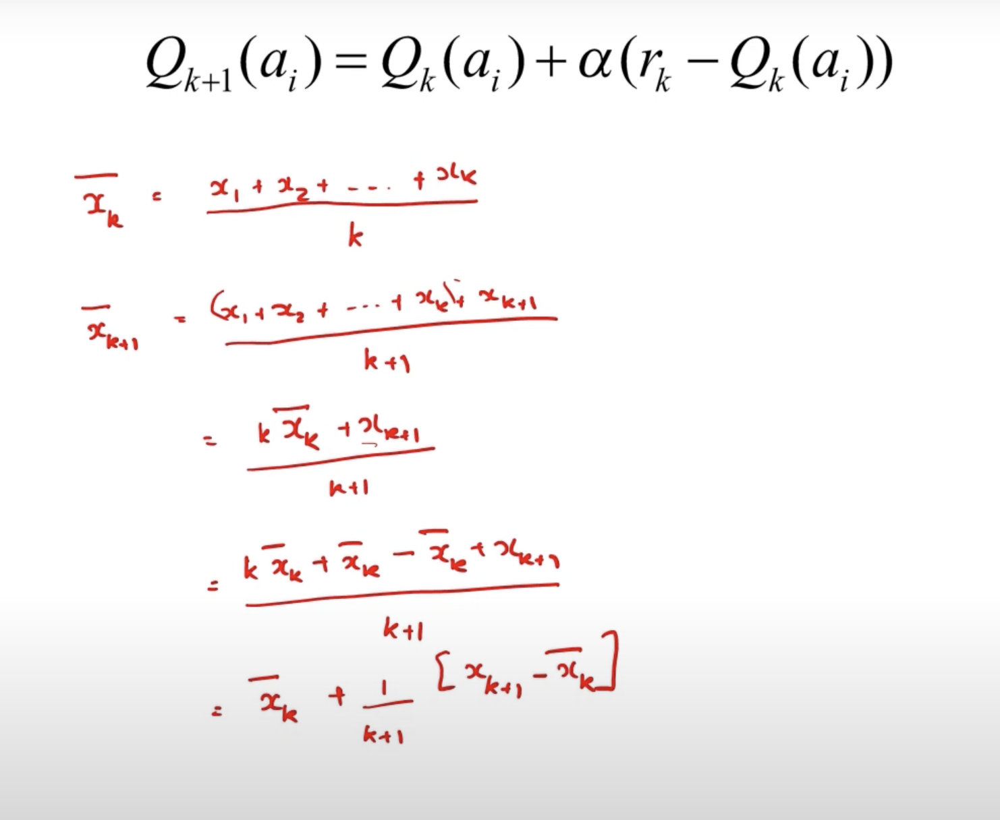
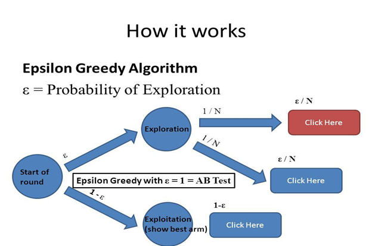

# Immediate RL & Bandits

In many scenarios, the action that we take don't show their effect immediately, but over time. Like when you lose in chess, which move caused you to lose might not be the last move you made. Or, when you fall of your bike, you don't know which action caused you to fall off.

But, In many cases, the **`action we take show their effect immediately`**.

!!! quote ""
    Like when you play a slot machine, you know exactly how much you won or lost. Each lever that you pull is an action, and the outcome is the reward that you get immediately. And, it doesn't effect later pulls.

Such problems are called **`Immediate RL`** or **`Multi-Armed Bandits`** problems.


---

## Exploration vs exploitation

- Exploration: Trying out new actions to find out which ones are good.
- Exploitation: Doing the action that gives the best reward.

!!! warning "Explore-Exploit dilemma"
    - Explore to find profitable actions.
    - Exploit to act according to the best observations already made.
    - Always exploit might not be optimal.
    - Always explore might not be optimal either.
    - Hence, there is an **`Explore-Exploit`** dilemma.

## Bandit problem

!!! note "Bandit problem"
    A **`Bandit`** is a problem where the action we take show their effect immediately.

---

## Traditional approaches

Let $r_{i,k}$ be the reward sample acquired when $i^{th}$ action is selected for the $k^{th}$ time.

Let $Q_i(t)$ be the estimated value of the $i^{th}$ action at time $t$.

$$
Q_i(t) = \frac{\sum_{k=1}^{t-1} r_{i,k}}{\sum_{k:r_i, k} 1}
$$

> Above formula is simply the average reward of the $i^{th}$ action.

- Optimal action is the one with the maximum reward.

$$
Q (a^{*}) = \max_{i} \{ Q ( a_{i} ) \}
$$

We can also write `estimated value` as:

$$
Q_{k+1} (a_{i}) = Q_{k} (a_{i}) + \alpha (r_{i,k+1} - Q_{k} (a_{i}))
$$

Setting $\alpha = \frac{1}{k+1}$ we get `average reward`.

> Proof:
> 

---

## Exploration approach: Choosing optimal action

Let's say we have 2 actions:

- `Action 1`: +1 reward with 0.8 probability, 0 reward with 0.2 probability.
- `Action 2`: +1 reward with 0.6 probability, 0 reward with 0.4 probability.

If we first choose `Action 2` and got `+1` reward, then we should choose `Action 2` again.

Action-reward table looks like this:

| Action | Last Reward | Avg reward |
|--------|--------|------------|
| 1      | 0      | 0          |
| 2      | 1      | 1          |

- Now, since action 2 has max avg reward, we should choose it again. And, get 0 reward.

Action-reward table looks like this:

| Action | Last Reward | Avg reward |
|--------|--------|------------|
| 1      | 0      | 0          |
| 2      | 0      | 0.5         |

- Now, even though last reward was 0, action 2 still has the max avg reward. So we will keep exploiting it for very very long time until avg reaches 0.

This is the **`problem with always exploiting (greedy)`**. If you get stuck with a suboptimal arm, you'll be in it for a very long time.

So, we need to explore more.

---

### Epsilon-Greedy

Select arm $a^* = \arg \max \{ Q_k(a_i) \}$ with probability $1-\epsilon$ and select any arbitrary arm with probability  $\epsilon$.



```python
p = random()

if p < epsilon:
    pull random action
else:
    pull current-best action
```

!!! success "Current-best arm choosing probability"
    We choose current-best arm with prob: $1-\epsilon$, and then again with $\epsilon \ast \frac{1}{N}$.

    $$ \mathbb{P}_{currentBest} = (1-\epsilon) + ( \epsilon \ast \frac{1}{N}) $$

---

### Softmax (`Boltzmann exploration`)

Select arms with probability proportional to the current value estimates.

$$
\pi (a_i) = \frac{exp(Q_k(a_i) / \tau)}{\sum_{j}{exp(Q_k(a_j) / \tau)}}
$$

- Thanks to softmax, even when `Q-value (action value)` is negative, we can take softmax and use that as probability distribution to choose next action.
- $\tau$ is **`temperature`**.
- If $\tau$ is very very large number (let's say 1 billion), all the (Q-value/$\tau$) will move to 0, making the probability distribution **`normal distribution`**.
- If $\tau$ is very small, (let's say 0.001), then even small differences will be blown up, and it will act like **greedy**.

!!! example ""
    Both `epsilon-greedy` and `softmax` give asymptotic convergence. They both eventually reach the best arm.
